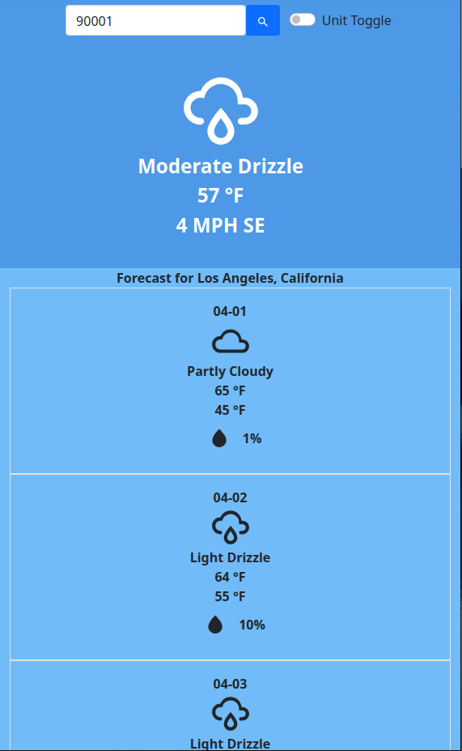

This project was created to gain familiarity with JavaScript, DOM manipulation, and API integration. It fetches weather data from the Open-Meteo API and displays current weather conditions and a 5-day forecast.

## Features
- Search for locations by postal code.
- View current weather conditions and a 5-day forecast.
- Toggle between Celsius and Fahrenheit units.

## Technologies Used
- HTML
- CSS
- JavaScript
- Open-Meteo API

## Future Improvements
- Enhance the UI with better styling and responsive design
- Add more robust error handling

## Screenshots
#### Desktop View


#### Mobile View


#### Search Suggestions


## Key Components of main.js

### 1. **Maps**
#### `weatherCodeMap`
- **Purpose**: Maps weather codes from the Open-Meteo API to human-readable weather descriptions.
- **Example Usage**: Used to display weather descriptions in the forecast and current conditions.
- **Example Entry**:
  ```javascript
  [0, "Clear Skies"], [61, "Light Rain"], [95, "Slight or Moderate Thunderstorm"]
  ```

#### `weatherIconMap`
- **Purpose**: Maps weather codes to corresponding weather icons (using Iconify icons).
- **Example Usage**: Used to display weather icons in the forecast and current conditions.
- **Example Entry**:
  ```javascript
  [0, "wi:day-sunny"], [61, "mdi:weather-rainy"], [95, "mdi:weather-lightning"]
  ```

#### `temperatureUnitMap`
- **Purpose**: Maps temperature units (`fahrenheit` or `celsius`) to their respective symbols (`°F` or `°C`).
- **Example Usage**: Used to display the correct temperature unit in the forecast and current conditions.
- **Example Entry**:
  ```javascript
  ["fahrenheit", "°F"], ["celsius", "°C"]
  ```

---

### 2. **Classes**
#### `Location`
- **Purpose**: Represents a location with properties such as postal code, latitude, longitude, and forecast data.
- **Properties**:
  - `postalCode`: The postal code of the location.
  - `admin1`: The state or region of the location.
  - `admin2`: The city or municipality of the location.
  - `coordinates`: An instance of the `Coordinates` class containing latitude and longitude.
  - `forecast`: The forecast data for the location.
- **Methods**:
  - `setForecast(forecast)`: Sets the forecast data for the location.
  - `setCurrentConditions(currentConditions)`: Sets the current weather conditions for the location.

#### `Coordinates`
- **Purpose**: Represents the latitude and longitude of a location.
- **Properties**:
  - `latitude`: The latitude of the location.
  - `longitude`: The longitude of the location.

#### `Forecast`
- **Purpose**: Represents the forecast data for a location.
- **Properties**:
  - `data`: The raw forecast data returned by the Open-Meteo API.

#### `CurrentConditions`
- **Purpose**: Represents the current weather conditions for a location.
- **Properties**:
  - `temperature`: The current temperature.
  - `winddirection`: The wind direction in degrees.
  - `windCardinalDirection`: The wind direction as a cardinal direction (e.g., N, NE, E).
  - `windspeed`: The wind speed.
  - `weathercode`: The weather code for the current conditions.
  - `is_day`: Indicates whether it is daytime.
- **Methods**:
  - `windDirectionConversion()`: Converts the wind direction in degrees to a cardinal direction.

---

### 3. **Functions**
#### `isValidPostalCode(postalCode)`
- **Purpose**: Validates whether a given postal code is a valid 5-digit number.
- **Parameters**:
  - `postalCode` (string): The postal code to validate.
- **Returns**: `true` if valid, `false` otherwise.

#### `buildGeoURL(postalCode)`
- **Purpose**: Constructs the URL for the Open-Meteo geocoding API based on the postal code.
- **Parameters**:
  - `postalCode` (string): The postal code to search for.
- **Returns**: A URL string.

#### `fetchSuggestions(query)`
- **Purpose**: Fetches location suggestions based on the user's query.
- **Parameters**:
  - `query` (string): The search query (e.g., postal code or location name).
- **Returns**: A promise that resolves to an array of location suggestions.

#### `displaySuggestions(suggestions)`
- **Purpose**: Dynamically updates the DOM with location suggestions.
- **Parameters**:
  - `suggestions` (array): An array of location objects returned by the geocoding API.

#### `getGeolocation(geolocationSearchURL)`
- **Purpose**: Fetches geolocation data for a given postal code.
- **Parameters**:
  - `geolocationSearchURL` (string): The URL for the geocoding API.
- **Returns**: A promise that resolves to the geolocation data.

#### `createForecast(forecastURL)`
- **Purpose**: Fetches forecast data for a given location.
- **Parameters**:
  - `forecastURL` (string): The URL for the forecast API.
- **Returns**: A promise that resolves to a `Forecast` object.

#### `buildForecastURL(myCoordinates)`
- **Purpose**: Constructs the URL for the Open-Meteo forecast API based on the coordinates.
- **Parameters**:
  - `myCoordinates` (Coordinates): An instance of the `Coordinates` class.
- **Returns**: A URL string.

#### `handleSearch()`
- **Purpose**: Handles the search functionality, fetching geolocation and weather data, and updating the DOM.
- **Steps**:
  1. Validates the postal code.
  2. Fetches geolocation data.
  3. Fetches forecast data.
  4. Updates the DOM with current weather and forecast information.

---

### 4. **Event Listeners**
#### `DOMContentLoaded`
- **Purpose**: Initializes the app when the DOM is fully loaded.
- **Key Listeners**:
  - **Input Suggestions**: Listens for user input in the search bar and fetches location suggestions.
  - **Click Outside Suggestions**: Clears the suggestions list when the user clicks outside.
  - **Search Button**: Triggers the `handleSearch` function when the search button is clicked.
  - **Enter Key**: Triggers the `handleSearch` function when the Enter key is pressed.
  - **Unit Toggle**: Toggles between Celsius and Fahrenheit and updates the forecast.

---
